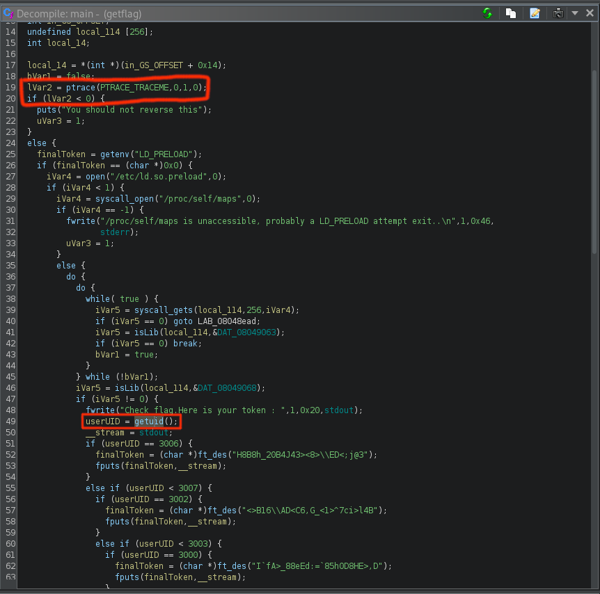

# Level 14

Home structure
```
$ ls -l
total 0
$ find / -user flag14 2>/dev/null
```
Mince, on ne trouve rien que très intéressant, ni dans le home, ni un fichier avec des permission. Rien dans le `/etc/passwd` à crack. <br/>
Vu du dernier level, qui nous introduit au disassemble, pourrait t'on disassemble le getflag ?

En ouvrant le program `getflag` dans ghidra, on récupère une version approximative du C<br/>
Sur l'image en dessous, on a entouré deux blocs intéressant et important.
- Le premier nous met un message d'erreur si on `trace` nous retourne `-1`.
- Le deuxième qui choppe le `getuid`.

Et la suite du program une forêt d'if, entre l'uid de l'exécuteur et d'autres uid.<br/>
Chaque condition a une liste de caractère passé à `ft_des` puis print le retour de celle-ci dans la stdout.



La suite va se passer dans gdb, pour pouvoir modifier la valeur de retour de `ptrace` et `getuid`.

Avant de lancer le programme, on met nos breakpoint, et pour chaque breakpoint on va avancer d'une ligne via la commande `s` et si on print la valeur de retour qui est dans le register $eax, on voit bien le `-1` de `ptrace`.<br/>
Alors tous simplement on change ce `-1` en `0` et continue jusqu'à `getuid` et refaire la même chose, en changeant le `2014` par `3014` qui est l'uid de l'utilisateur `flag14` (Trouvé via `cat /etc/passwd`)
```
$ gdb /bin/getflag
(gdb) b ptrace
Breakpoint 1 at 0x8048540
(gdb) b getuid
Breakpoint 2 at 0x80484b0
(gdb) r
Starting program: /bin/getflag

Breakpoint 1, 0xb7f146d0 in ptrace () from /lib/i386-linux-gnu/libc.so.6
(gdb) s
(gdb) p $eax
$1 = -1
(gdb) p $eax = 0
$2 = 0
(gdb) c
Continuing.

Breakpoint 2, 0xb7ee4cc0 in getuid () from /lib/i386-linux-gnu/libc.so.6
(gdb) s
0x08048b02 in main ()
(gdb) p $eax
$3 = 2014
(gdb) p $eax = 3014
$4 = 3014
(gdb) c
Continuing.
Check flag.Here is your token : 7QiHafiNa3HVozsaXkawuYrTstxbpABHD8CPnHJ
```